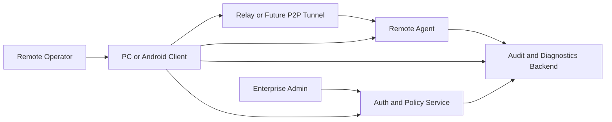
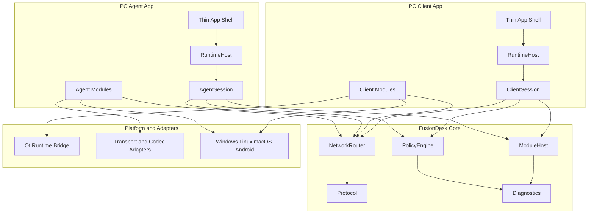
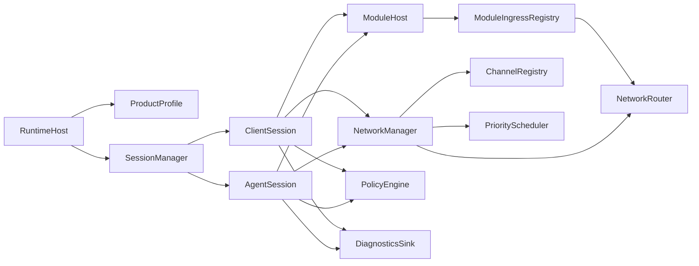
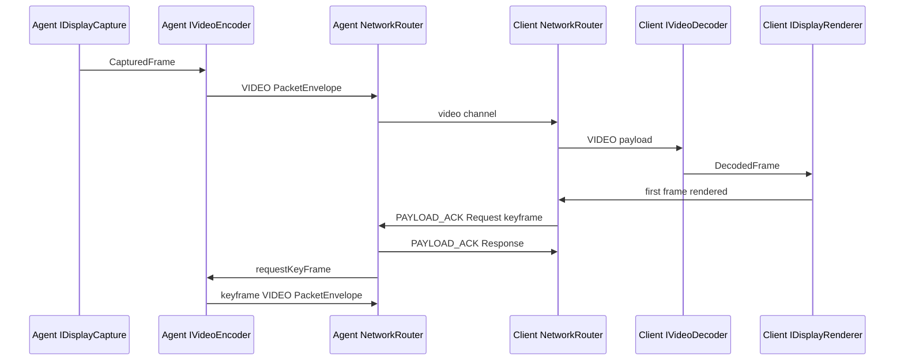
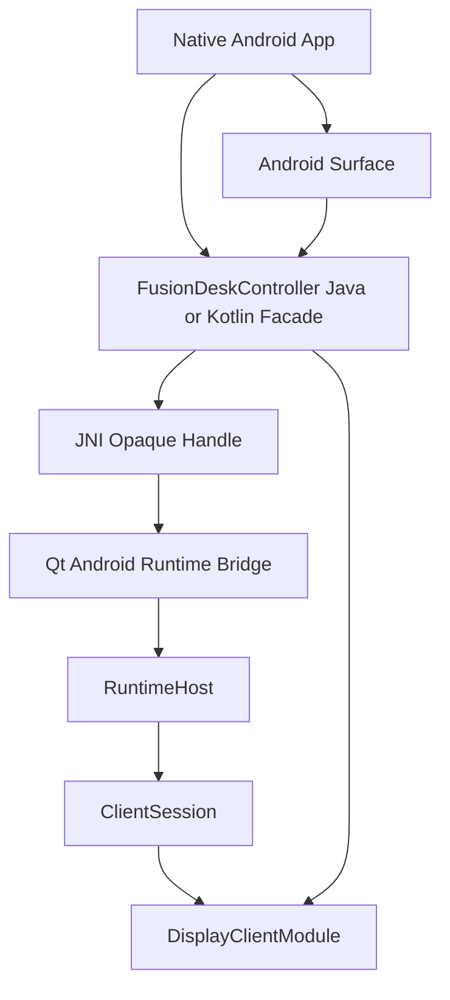

# C4 Architecture Views

This document provides lightweight C4-style views for the `FusionDesk` rebuild. Keep this file updated when ownership or runtime boundaries change.

## System Context



System responsibilities:

```text
Client controls remote desktop sessions.
Agent exposes authorized remote control capabilities.
Auth and Policy authorizes users, features, modules, and transport modes.
Relay or P2P Tunnel provides transport when direct LAN is unavailable.
Audit backend receives enterprise diagnostics and data movement events.
```

## Container View



Container rules:

```text
apps are thin
runtime composes
core contracts stay pure C++
modules implement features
platform and adapters hold Qt, OS, transport, codec, and external technology dependencies
```

## Component View - Session Runtime



## Component View - Display MVP



## Component View - Android Controller Library



Android rules:

```text
public API exposes Android types only
JNI handle is opaque
Surface lifecycle maps to renderer attach and detach
session lifecycle is not the same as Activity lifecycle
Qt stays behind runtime and binding boundaries
```

## Deployment View

```text
Windows x64
  pc client
  pc agent
  auth or service components

Linux x86_64 and arm64
  pc client
  pc agent
  auth or service components

macOS x86_64 and arm64
  planned client first, agent by capability

Android arm64-v8a
  Qt client
  embeddable controller AAR

Android x86_64
  emulator and CI test ABI
```
