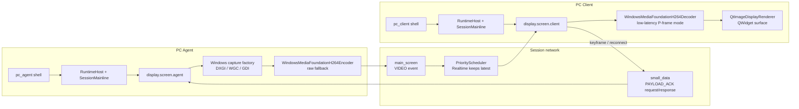

# Display Screen Pipeline Design

This document defines the target `display.screen` pipeline for the `FusionDesk`
rebuild. It consolidates lessons from the legacy FusionDesk display code and
from mature open-source remote desktop and streaming projects.

No third-party implementation is copied into `FusionDesk`. External projects are
used only as architecture references.

## Scope

`display.screen` owns screen capture, frame packaging or encoding, frame
receive, decode, render, keyframe recovery, and display health diagnostics.

It does not own sockets, application windows, product authorization, or tunnel
selection.

```text
Session owns lifecycle and reconnect.
Network owns channels, priority, pressure, routing, and transport adapters.
Policy owns allow, deny, audit, and display constraints.
display.screen owns display behavior and module payload compatibility.
Platform adapters own OS capture and injection APIs.
Qt adapters own render surfaces and UI-thread integration.
```

## Current Windows Pipeline View



Current H.264 status:

```text
Default product fallback when rollout policy is off or probe fails: raw_bgra
Windows validation/product codec: windows.media_foundation.h264
All-intra validation: immediate decode/render path
P-frame validation: FUSIONDESK_MF_H264_PFRAME=1
P-frame product rollout: ProductDisplayCodecPolicy / --display-codec-policy windows-h264-production
P-frame decode model: one-frame delayed output through DisplayDecodeStatus::NeedsMoreInput
Production promotion owner: product rollout policy and UI/service diagnostics, not display module internals
Current product diagnostics surface: session.diagnostics.display_codec rows expose selected adapter, codec, backend, selectionMode, fallbackReason, deltaFrames, and delayed decoder counters
Current product health surface: DisplayProductDiagnosticsSnapshot/buildDisplayProductDiagnostics and DisplayProductHealthPresentation/buildDisplayProductHealthPresentation collapse session, link/channel, display module, capture, and codec state into ok/warning/degraded/blocked plus usable and stable status/action/capture/codec state codes for PC UI/service readers; session.diagnostics.display_health prints the same presenter output for transition tooling
```

## Reference Projects

Reference repositories:

```text
RustDesk: https://github.com/rustdesk/rustdesk
Moonlight Qt: https://github.com/moonlight-stream/moonlight-qt
TigerVNC: https://github.com/TigerVNC/tigervnc
RabbitRemoteControl: https://github.com/KangLin/RabbitRemoteControl
FreeRDP: https://github.com/FreeRDP/FreeRDP
Sunshine: https://github.com/LizardByte/Sunshine
```

Local research checkout:

```text
E:/workspace/GIT_CODE/ASTUTE/Production-HSR2/_research/display-screen
```

## Mature Scheme Comparison

The mature projects point to the same design direction: keep capture, codec,
render, transport, policy, and UI lifecycle separate. FusionDesk should borrow
those boundaries and recovery patterns, not their protocol stacks or UI
frameworks.

| Project | Mature pattern to learn from | FusionDesk decision | Do not copy |
| --- | --- | --- | --- |
| RustDesk | Platform capture library, video service owner, codec fallback, display-change handling, privacy/protected-content states | Keep capture adapters rebuildable and report platform display states through diagnostics | Global service state, Rust/Flutter ownership model, platform details in core |
| Moonlight Qt | Decoder/render backend capability model, bounded queues, frame pacing, rich video stats | Split decoder and renderer selection; add received/decoded/rendered/dropped/latency counters | SDL/GameStream assumptions, game-only low-latency defaults |
| TigerVNC | Dirty region, full refresh, incremental refresh, lossy then lossless repair | Keep graphic patch and lossless refresh as future display payload modes | RFB protocol and client-driven update loop as the primary realtime path |
| FreeRDP | Surface-based graphics, frame start/end, reset graphics, capability confirm, frame acknowledge | Add stable surface/frame/control schema inside display.screen payloads | RDPGFX protocol stack or channel mux bypassing FusionDesk Network |
| Sunshine | Capture-to-encoder pipeline, hardware codec matrix, zero-copy direction, consumer-aware capture lifecycle | Add encoder/capture capability flags and pause capture when no video consumer exists | GameStream protocol and monolithic video service shape |
| RabbitRemoteControl | Qt plugin/product shell organization with multiple protocols | Keep UI/product connection management plugin-friendly while display.screen stays a FusionDesk module | Direct third-party protocol objects in app/UI or core |

The adopted direction is a native FusionDesk display protocol above the common
`PacketEnvelope`, with module-owned display payload compatibility and replaceable
transport adapters.

## Reference Lessons

### Legacy FusionDesk

The old display implementation has useful behavior, but the coupling should not
be preserved.

Useful behavior:

```text
main screen and second screen are separate logical channels
client requests keyframe/SPS after connect, reconnect, or decoder reset
each payload can ACK timestamp for latency and bitrate control
encoder caches recent keyframe packet for recovery
decoder queue drops stale payloads around the latest keyframe
resolution changes rebuild capture, encoder, decoder, and render state
Windows supports DXGI, GDI, and mirror-driver style capture paths
Linux X11 uses XDamage/XShm style dirty tracking
watermark and cursor messages are display-related side streams
```

Coupling to avoid:

```text
display module directly depending on app controllers or config singletons
QWidget pointers exported across feature module boundaries
module-owned concrete TCP channels
display-owned socket retry, heartbeat, and backpressure
fire-and-forget keyframe requests
packed legacy bitfields as the new primary protocol shape
background render threads manipulating UI widgets without a clear adapter owner
```

### RustDesk

RustDesk is the closest reference for a modern remote desktop display pipeline.

Useful ideas:

```text
capture, encoder, decoder, and platform behavior are strongly separated
Windows, X11, Wayland, Android, and hardware codec paths stay behind adapters
quality control reacts to RTT, latency, FPS, bitrate, and user quality settings
platform capture errors are normal runtime states, not fatal module crashes
codec fallback is explicit
display changes and privacy/security states are handled as pipeline events
```

What not to copy:

```text
global service state mixed with display logic
codec negotiation embedded in broad service code
large codec and platform matrix in the first FusionDesk slice
Rust-specific ownership and configuration patterns
```

### Moonlight Qt

Moonlight Qt is most useful on the client rendering side.

Useful ideas:

```text
decoder interface separates initialization, submit, render, and window change
decoder recreation drops input until the next IDR/keyframe
frame pacing is separated from decode and render queues
render queues are bounded and stale frames are dropped
received, decoded, rendered, dropped, and latency metrics are first-class
platform renderers are selected as adapters with software fallback
```

What not to copy:

```text
game-streaming specific session model
full vsync pacer and hardware renderer matrix in the first slice
SDL/Limelight assumptions leaking into FusionDesk module contracts
```

### TigerVNC

TigerVNC is the best reference for full refresh, incremental refresh, region
tracking, and TCP congestion avoidance.

Useful ideas:

```text
non-incremental framebuffer update request maps well to keyframe/full refresh
dirty-region tracking can become a later graphic patch mode
congestion detection should avoid socket buffer bloat
encoding capabilities and desktop-size/cursor updates are negotiated explicitly
viewer can adapt quality from observed throughput
```

What not to copy:

```text
RFB protocol as the FusionDesk protocol
request-driven VNC update loop as the realtime video path
Tight/ZRLE/Hextile codecs as the first display implementation
single-threaded server ownership model
```

### RabbitRemoteControl

RabbitRemoteControl is useful mainly as a Qt integration reference and as a
warning about coupling.

Useful ideas:

```text
protocol backends can be plugin-like while UI operations stay unified
QImage framebuffer wrapping is a practical software-rendering fallback
Qt signal/slot bridging around protocol libraries reveals event-loop issues
```

What not to copy:

```text
Qt plugin object owning capture, protocol, channel, and UI behavior together
third-party VNC/RDP library shape as FusionDesk's internal shape
coarse full-frame service loop as the primary low-latency pipeline
```

### FreeRDP

FreeRDP is useful as a protocol architecture reference, especially its graphics
channel separation and surface model.

Useful ideas:

```text
graphics traffic is negotiated through explicit capability sets
surface create/update/delete is distinct from monitor topology
frame start/end gives the receiver a clear commit boundary
frame acknowledge reports decoded frame id and queue depth
reset graphics carries desktop geometry and monitor definitions
scaled-output mapping is explicit instead of hidden in the renderer
codec ids and pixel formats are stable protocol facts
```

What not to copy:

```text
RDPGFX protocol as the FusionDesk display payload
FreeRDP channel multiplexing below our ChannelRegistry
GDI-first client architecture
display operation compatibility decided outside display.screen
```

### Sunshine

Sunshine is useful for production capture and encoder strategy.

Useful ideas:

```text
platform-specific capture code is below a common streaming pipeline
hardware and software encoder capabilities are modeled explicitly
forced IDR/keyframe is a first-class encoder operation
zero-copy paths matter for DXGI/D3D, VAAPI, VideoToolbox, and MediaCodec
capture should be tied to active consumers, not always-on loops
```

What not to copy:

```text
GameStream session and packet model
aggressive game-streaming quality defaults for enterprise remote desktop
large monolithic video service implementation
codec policy hidden inside platform code
```

## Adopted Design Decisions

These are the display.screen design decisions for the FusionDesk rebuild.

```text
1. Session and ModuleHost only start, stop, pause, resume, and version-gate modules.
2. Network owns logical channels, socket binding, pressure, routing, and reconnect.
3. display.screen owns display payload schemas, codec compatibility, keyframe behavior, surface state, and renderer recovery.
4. Qt, D3D, OpenGL, X11, Wayland, Android Surface, and codec libraries terminate at adapters.
5. Apps and product UI invoke runtime services or controller facades; they do not call module internals.
6. Realtime video is allowed to drop stale deltas; control and recovery requests must receive terminal responses.
7. Transport choices, including TCP, relay, tunnel, and WebRTC, are adapters below the same channel contract.
```

Rejected shortcuts:

```text
do not migrate old Source display classes into FusionDesk as runtime dependencies
do not make WebRTC the display protocol
do not let video channel failure imply session failure
do not hide keyframe/open-render/decoder-reset requests as fire-and-forget ACKs
do not let QWidget, QWindow, QQuickItem, QImage, or Android Surface enter module contracts
do not make the application shell own the capture loop or frame pump
```

## Current FusionDesk Baseline

Already implemented:

```text
DisplayAgentModule and DisplayClientModule
IDisplayCapture, IVideoEncoder, IVideoDecoder, IDisplayRenderer
RawFrameEncoder and RawFrameDecoder with FDRF schema v1
DisplayCodecId, DisplayCodecDirection, DisplayCodecBackendKind, DisplayCodecCapability, DisplayCodecSelectionRequest, defaultDisplayCodecCapabilities, and selectDisplayCodec as the pure runtime codec selection contract; current default selection keeps raw_bgra as the available fallback while H.264/H.265/AV1 hardware/software adapters remain explicit unavailable slots until real adapter factories provide available candidates
IDisplayCodecBackendFactory, StaticDisplayCodecBackendFactory, RawFrameDisplayCodecBackendFactory, DisplayCodecBackendFactoryRegistry, createSelectedDisplayEncoder, and createSelectedDisplayDecoder as the first codec factory injection contract; PC agent/client startup now gets the current raw encoder/decoder through this path instead of direct raw codec construction
DisplayCodecNegotiationRequest, DisplayCodecNegotiationResult, and negotiateDisplayCodec as the pure runtime two-peer codec intersection contract; it tries common codec preferences in order, requires an agent encoder selection and a client decoder selection for the same codec, preserves raw fallback when allowed, and rejects exact-backend requests instead of silently falling back
WindowsMediaFoundationDisplayCodecBackendFactory, probeWindowsMediaFoundationH264Codec, and preflightWindowsMediaFoundationH264Adapter as the first Windows H.264 codec capability/probe/preflight skeleton; it publishes a rollout-gated MediaFoundation candidate ahead of raw fallback, keeps it unavailable unless validation or production rollout policy enables selection, and exercises BGRA-to-NV12 plus decoder output type checks during opt-in preflight
preflightWindowsMediaFoundationH264Encode as the first opt-in Windows H.264 single-frame encode/decode validation gate; it enumerates encoder MFTs, configures the first CPU-input candidate, feeds a synthetic frame, collects real bitstream bytes, validates FDSF wrapping, and validates direct factory decode without changing production selection
WindowsMediaFoundationH264Encoder as the first direct-create MediaFoundation IVideoEncoder implementation for validation and startup integration; it drains all output after each input frame, uses monotonic sample timestamps, recreates the encoder for requested keyframes when the host MFT does not support AVEncVideoForceKeyFrame, keeps all-intra behavior when P-frame mode is disabled, and keeps encoder state for opt-in true P-frame validation or ProductProfile rollout when policy enables it
WindowsMediaFoundationH264Decoder as the first direct-create MediaFoundation IVideoDecoder implementation for validation and future startup integration; it accepts FDSF-wrapped H.264, selects decoder-published NV12/RGB32/ARGB32 output types, enables decoder low-latency mode when supported, marks keyframe input samples as clean points, preserves delayed-output frame metadata, converts NV12 output to BGRA through runtime/display, recreates decoder state for keyframe sequence headers, and avoids per-frame drain on the P-frame continuous stream
FUSIONDESK_SELECT_MF_H264 as the validation-only selector gate that can mark windows.media_foundation.h264 available when the host probe succeeds; ProductDisplayCodecPolicy as the product rollout gate that lets the default Windows codec preference choose H.264 with raw fallback when unavailable
FUSIONDESK_VALIDATE_PC_H264_DISPLAY as the opt-in real PC agent/client Windows-Windows H.264 first-frame plus reconnect fresh-frame smoke gate
FUSIONDESK_MF_H264_PFRAME as the opt-in true P-frame delta-compression switch, and FUSIONDESK_VALIDATE_MF_H264_PFRAME as the focused keyframe plus P-slice validation gate
convertBgraToNv12, convertNv12ToBgra, and Nv12Frame as pure runtime CPU color-conversion helpers that turn validated Bgra32 CapturedFrame input into NV12 Y/UV planes and decoder NV12 output back into BGRA for the MediaFoundation H.264 validation path and future codec adapters
VIDEO Event on main_screen/video channel
PAYLOAD_ACK Request/Response for keyframe recovery
first-frame and keyframe diagnostics
delta-frame drop when main_screen is congested or draining
reconnect pause/resume hooks with fresh-state keyframe recovery
WindowsGdiDisplayCapture adapter
pure DisplayCaptureBackendCapability and DisplayCaptureBackendSelectionResult contracts
pure capture backend selector for the documented Windows/Linux/macOS/Android/Harmony/RK backend matrix
IDisplayCaptureBackendFactory and WindowsGdiDisplayCaptureFactory as the first selector-backed factory path
IDisplayCaptureBackendFactory createSourceCatalog contract so product UI/source pickers can request source topology through the selected backend factory instead of switching on platform adapter classes
DisplayCapturePlatformPlanRequest, DisplayCaptureRuntimeRole, DisplayCaptureCapabilitySource, and planDisplayCapturePlatform as the pure startup-planning contract that separates real probed factory capabilities from diagnostic-only unavailable default matrices and marks client roles render-only
DisplayCaptureBackendCapability available/unavailableReason for runtime probe diagnostics and safe fallback
DisplayTargetArchitecture and DisplayTargetSocProfile selector tags for architecture or board-specific backend filtering
parseDisplayCaptureSourceType, parseDisplayPlatformFamily, parseDisplayTargetArchitecture, and parseDisplayTargetSocProfile normalize CLI/CI strings such as monitor, window, virtual-display, media-projection, windows, linux-x11, wayland, darwin, android-agent, openharmony, rk3588-linux, amd64, aarch64, loongarch64, mips64el, rk3568, and rk3588 before selector filtering
DisplayCaptureBackendFailoverRequest, selectDisplayCaptureBackendFailover, and createFailoverDisplayCapture as the pure runtime plan/create contract for excluding a failed backend and choosing the next compatible backend
StaticDisplayCaptureBackendFactory and DisplayCaptureBackendFactoryRegistry as reusable runtime composition helpers
unavailableDefaultDisplayCaptureBackendCapabilities and createUnavailableDefaultDisplayCaptureBackendFactory to expose full-platform placeholder diagnostics before concrete adapters land
WindowsDxgiDesktopDuplicationCapture as the first compiled DXGI Desktop Duplication adapter path
WindowsDxgiDesktopDuplicationDisplayCaptureFactory direct-create path, with default runtime probe before selector availability and FUSIONDESK_ENABLE_DXGI_CAPTURE=0 as an explicit disable switch
fusiondesk_windows_dxgi_display_capture_opt_in_tests as an explicit FUSIONDESK_VALIDATE_DXGI_CAPTURE=1 real-frame validation gate that skips by default and fails only when validation is requested; the manual gate validates a bounded fit target so DXGI does not bypass the raw-frame transport guard
WindowsDxgiDesktopDuplicationCapture caches the latest successful frame and can resend it as a keyframe/full-refresh when DXGI returns FrameTimeout during a keyframe request, so static desktops can recover after video-channel reconnect
WindowsCursorOverlay maps the current Win32 cursor/hotspot into the selected source/fit/stretch BGRA frame, and Windows GDI/DXGI adapters compose it by default through `DisplayCaptureOpenOptions::includeCursor`; PC shell `--display-no-cursor` disables it for diagnostics or future cursor sideband experiments, and line-oriented capture diagnostics print the effective includeCursor value
DisplayCaptureStatus as the module-level capture diagnostics contract, currently populated by Windows GDI and DXGI adapters for source, permission/system-call, timeout, device-loss, invalid-frame, unsupported, and success states
displayCaptureStatusCodeName exposes stable display capture status names for product UI and field logs
Windows DXGI native failures are classified into stable groups for recovery: access-lost maps to source/hotplug recovery, device removed/reset maps to device-loss recovery, and permission/session errors keep separate recoverability flags
runtime/display decideDisplayCaptureRecovery maps stable capture statuses to recovery actions such as retry-next-frame, reopen-capture, recreate-capture, switch-backend, or wait-for-permission
DisplayCaptureRecoveryPolicy, DisplayCaptureRecoveryState, and DisplayCaptureRecoveryPlan add the first production guardrails for same-backend recovery attempt limits, failed-recovery cooldown, and repeated recoverable-failure promotion to switch-backend
DisplayAgentModule::reopenCapture is the current executable recovery operation for recoverable reopen/recreate cases; it closes the selected adapter, reopens it with the same capture options, and can send a fresh keyframe
DisplayAgentModule::replaceCapture plus DisplayRuntimeService switch-backend execution can create a compatible failover backend through createFailoverDisplayCapture, replace the active capture adapter, and send a fresh keyframe when the service is configured with a backend factory
IDisplayCapture::backendId as the stable selected-backend identity contract for diagnostics and UI
IDisplayCapture::captureErrors as the stable adapter error-count contract for runtime, session, PC shell, and future UI diagnostics
DisplayCaptureBackendSelectionRequest::requestedAdapterId and PC shell --display-capture-backend for explicit auto/gdi/dxgi/wgc/exact adapter selection during rollout and field diagnostics
DisplayAgentSnapshot, DisplayRuntimeServiceSnapshot, SessionRuntimeDiagnosticsSnapshot, and PC shell session diagnostics expose the selected backend id, latest capture status, captureErrors count, and recovery action so runtime readers do not need platform adapter access
WindowsGraphicsCaptureDisplayCaptureFactory as a rollout-gated WGC monitor/window backend with FUSIONDESK_ENABLE_WGC_CAPTURE diagnostics for disabled, not-enabled, and enabled/probed states
DisplayCaptureOpenOptions sourceType/nativeSourceHandle contract so WGC can open monitor sources by sourceId and window sources by sourceId or native HWND handle
WindowsDisplayCaptureBackendFactory as the Windows registry-backed aggregate factory path for DXGI/WGC/GDI registration; current selection probes DXGI by default and falls back to GDI when DXGI is disabled or unavailable
WindowsDxgiDesktopDuplicationSourceCatalog and WindowsGdiDisplaySourceCatalog expose backend-specific monitor topology snapshots for source-selection diagnostics; WindowsGraphicsCaptureSourceCatalog exposes monitor plus visible-window topology
Windows GDI and DXGI reject invalid source ids with SourceNotFound instead of silently falling back to the primary monitor
DisplayAgentModule records the last successfully sent frame shape and promotes source, geometry, stride, or pixel-format changes on a later delta capture into a keyframe/full-refresh frame with a `captureGeometryOrFormatChanges` counter and `display.capture_geometry_or_format_changed` diagnostic
QtImageDisplayRenderer adapter
QtImageDisplayWindow as the first QWidget visible PC client surface bound to the Qt image renderer
PC client/agent QCoreApplication display smoke routes
PC agent --start-display now owns the CLI display runtime pump for the agent side; --display-fps adjusts the same pump
PC client --start-display now starts DisplayRuntimeService in client monitoring mode; --display-first-frame-timeout-ms controls the first-frame recovery timeout and --print-display-runtime-diagnostics emits stable runtime rows for smoke/UI handoff
DisplayRuntimeServiceSnapshot now carries basic capture health metrics: pump count, frame attempts, last pump/attempt timestamps, first/last delivered-frame timestamps, last observed frame age, effective FPS x1000, and consecutive frame misses; PC shell display.runtime rows print the same fields for smoke scripts and future UI/service readers
DisplayAgentSnapshot, DisplayClientSnapshot, DisplayRuntimeServiceSnapshot, SessionRuntimeDiagnosticsSnapshot, and PC shell diagnostics carry byte-level throughput counters for captured pixels, encoded payloads, sent payloads, received payloads, decoded/rendered pixels, last frame byte sizes, and service-observed effective bitrate Kbps
DisplayCodecRuntimeInfo flows selected encoder/decoder codec metadata into DisplayAgentSnapshot, DisplayClientSnapshot, SessionRuntimeDiagnosticsSnapshot, and PC shell session.diagnostics.display_codec rows so UI/service readers can consume codec rollout, raw fallback reason, P-frame/delta-frame state, payload/error counters, and delayed decoder counters without parsing codec-plan stdout
DisplayProductDiagnosticsSnapshot folds SessionRuntimeDiagnosticsSnapshot rows into display health for product readers, and DisplayProductHealthPresentation adds stable status/action/capture/codec state codes; PC shell prints the same data as session.diagnostics.display_health while the production UI/service binding is still pending
PC client --show-display-window can open the QWidget display surface without changing display module contracts
PC agent --start-display passes the Windows aggregate capture factory and selector request into DisplayRuntimeService, so auto backend selection can fail over from a failed DXGI path to a compatible WGC/GDI candidate when available
runtime/display withDefaultRawFrameCaptureTarget defines the raw-frame MVP default of a bounded 1280x720 fit target unless the caller explicitly supplies target dimensions or source scale
runtime/display resolveDisplayCaptureOutputSize is the shared source/stretch/fit geometry rule used by Windows GDI and DXGI capture adapters
PC shell forwards --display-source-type, --display-target-platform, --display-target-arch, and --display-target-soc into the backend selection request for source, platform, architecture, and SoC-specific rollout diagnostics
PC agent capture creation now runs Windows factory capabilities through planDisplayCapturePlatform before createSelectedDisplayCapture, so platform adapter wiring uses the same role/capability-source startup contract as future Linux/macOS/Android/Harmony adapters
PC shell --print-display-capture-plan prints stable capture planning rows for role, platform, capability source, candidates, selected backend, and rejection messages so backend rollout can be diagnosed without platform-adapter logs
PC shell --print-display-sources prints stable source catalog rows through the selected capture backend factory so monitor/window selection can be diagnosed before a visible UI exists; the row includes ok/source/requested/provider/rejected/message fields, requested source id/native handle, selected-source match state, and failed discovery emits source-catalog/source-selection message rows for product UI and service readers
PC shell --print-display-codec-plan prints stable codec planning rows for direction, platform, preference, requested backend, selected adapter, codec id, fallback/hardware/zero-copy flags, candidate rows, and rejection/message rows
PC shell --display-codec-negotiate-local runs the pure two-peer codec negotiation helper against local agent-encoder and client-decoder capability views, prints display.codec.negotiation rows when codec plan diagnostics are requested, and pins the current role to the negotiated adapter; it is a Windows-Windows diagnostic bridge before FDPP carries real peer inventories
FDPP now has a generic opaque PeerProfileExtension carrier, and runtime/display owns the display.codec.v1 payload codec for encoder/decoder selection requests plus codec candidate inventories; PC shell --display-codec-negotiate-fdpp consumes it live by sending the client decoder inventory, negotiating on the agent against local encoder inventory, returning selected encoder/decoder inventory, and pinning both roles before display dependency creation
FUSIONDESK_ENABLE_MF_CODEC enables standalone MediaFoundation H.264 probe/preflight diagnostics; startup selection can use ProductDisplayCodecPolicy for production or FUSIONDESK_SELECT_MF_H264=1 for validation, so default startup remains on raw when policy is off or the host probe fails; preflight diagnostics also validate BGRA-to-NV12 conversion, decoder output type acceptance, and NV12 plane byte counts
FUSIONDESK_VALIDATE_MF_H264_ENCODE turns the platform smoke into a manual real encode/decode gate that requires H.264 bitstream output, FDSF payload encoding, direct factory decode, and BGRA decoded output on the current host
FUSIONDESK_VALIDATE_PC_H264_DISPLAY turns the PC two-peer smoke into a manual Windows-Windows H.264 first-frame plus reconnect fresh-frame gate that requires both agent and client codec plans to select windows.media_foundation.h264, a rendered display frame to arrive over the normal main_screen channel, and reconnect diagnostics to report a successful main_screen rebind
fusiondesk_display_codec_negotiation_tests covers the pure negotiation contract, fusiondesk_display_codec_peer_profile_tests covers the display.codec.v1 inventory payload, and fusiondesk_pc_peer_profile_start_display_smoke covers live PC startup exchange over FDPP for the current raw fallback path
FDPP profile negotiation for main_screen after bootstrap control channel
FDMI module inventory exchange before module start
client-side frame ordering guard: stale/duplicate frames are dropped before decode, delta frame-id gaps request keyframe recovery, and decode failures request recovery with counters
DisplayRuntimeService client first-frame timeout monitoring can send a `FirstFrameTimeout` keyframe Request over `small_data` when no frame has rendered and no keyframe request is already pending
DisplayRuntimeService client reconnect monitoring records the rendered-frame baseline at reconnect resume and can send another `Reconnect` keyframe Request when no fresh frame renders after channel rebind
```

Not implemented yet:

```text
production polished PC GUI shell around the first QWidget display surface
production monitor selection and capture policy
product-tuned recovery thresholds, policy overrides, and operator-visible controls for backend failover after DXGI device-loss or hotplug failures
cursor sideband and detailed error diagnostics
product UI rendering of capture status snapshots
non-Windows adapter implementations beyond the current Windows monitor/window adapters
production decoder reset policy beyond current keyframe recovery requests
per-stage display latency histograms, queue-depth health, and product-level display health dashboards beyond the current DisplayProductDiagnosticsSnapshot/DisplayProductHealthPresentation surfaces
hardware codec adapters
production PC UI/service binding to negotiated non-raw codec diagnostics and encoder/decoder reset policy around those codecs
X11, Wayland, macOS, Android capture adapters
OpenGL, D3D, VA, Metal, Android surface renderers
second-screen production orchestration
cursor bitmap and watermark payload handling
```

## Target Layering

```text
apps/pc/client_gui_widgets or apps/android/client_qml
  -> Qt display view adapter
  -> runtime/display DisplayRuntimeService
  -> display.screen client module
  -> NetworkRouter / ChannelRegistry / PriorityScheduler
  -> TransportAdapter

apps/pc/agent_service
  -> runtime/display DisplayRuntimeService
  -> display.screen agent module
  -> platform display capture adapter
  -> NetworkRouter / ChannelRegistry / PriorityScheduler
  -> TransportAdapter
```

Core and module code remain UI independent:

```text
display.screen module must not include QWidget, QImage, QWindow, QThread, or QTimer.
runtime/display may own pure service loops and policy decisions.
runtime/qt may bind timers and event loops to runtime/display.
adapters/qt may own QImage, QWidget, QOpenGLWidget, QQuickItem, or Android surface bridges.
```

## Target Components

Agent side:

```text
DisplayRuntimeService
  -> DisplayAgentModule
    -> ScreenSource
    -> IDisplayCapture
    -> FrameQueue
    -> IVideoEncoder
    -> DisplaySender
    -> DisplayAckHandler
```

Client side:

```text
DisplayRuntimeService
  -> DisplayClientModule
    -> DisplayReceiver
    -> DecodeQueue
    -> IVideoDecoder
    -> RenderQueue
    -> IDisplayRenderer
    -> DisplayAckSender
```

The MVP can keep `DisplayAgentModule::sendDeltaFrame()` as the module entry
point, but the owner that decides when to call it should be a runtime service,
not the application shell.

## Production Decomposition

Agent production stack:

```text
SessionMainline / ModuleHost
  -> DisplayRuntimeService
    -> DisplayAgentModule
      -> SourceSelectionController
      -> CaptureController
      -> IDisplayCapture
      -> FrameQueue
      -> IVideoEncoder
      -> DisplaySender
      -> DisplayControlHandler
      -> DisplayDiagnosticsPublisher
```

Client production stack:

```text
SessionMainline / ModuleHost
  -> DisplayRuntimeService
    -> DisplayClientModule
      -> DisplayReceiver
      -> DisplayPayloadValidator
      -> DecodeQueue
      -> IVideoDecoder
      -> RenderQueue
      -> IDisplayRenderer
      -> DisplayControlSender
      -> DisplayDiagnosticsPublisher
```

Adapter stack:

```text
platform/windows/display
  WindowsGdiDisplayCapture
  future WindowsDxgiDisplayCapture
  future WindowsGraphicsCaptureAdapter

platform/linux/display
  future X11DamageDisplayCapture
  future PipeWireDisplayCapture

platform/macos/display
  future QuartzDisplayCapture
  future ScreenCaptureKitDisplayCapture

adapters/qt/display
  QtImageDisplayRenderer
  future QtWidgetDisplaySurface
  future QtOpenGLDisplayRenderer
  future QmlDisplayItemRenderer

adapters/codec
  future FfmpegVideoEncoder/Decoder
  future MediaFoundationVideoEncoder/Decoder
  future VAAPI/VideoToolbox/MediaCodec adapters

runtime/display
  convertBgraToNv12 CPU fallback for adapters that require NV12 input
```

## Production Capture Backend Strategy

Capture backend selection is a platform adapter decision. It must be driven by
source type, OS permission model, policy, memory path, and runtime stability.
CPU architecture and SoC model affect build artifacts and optional capture,
codec, or zero-copy adapters, but they do not change the display module
contract. The selector can filter backend capabilities by architecture and
SoC profile when an adapter is board-specific; generic platform backends leave
those capability lists empty.

| Platform family | Preferred production backend | Fallback path | Notes |
| --- | --- | --- | --- |
| Windows desktop | DXGI Desktop Duplication for monitor capture; Windows Graphics Capture for modern monitor/window capture | Current GDI adapter | DXGI adapter compiles and can be direct-created; the aggregate factory probes DXGI by default before selector availability, `FUSIONDESK_ENABLE_DXGI_CAPTURE=0` disables it for diagnostics or rollout control, `FUSIONDESK_VALIDATE_DXGI_CAPTURE=1` runs manual real-frame validation without changing default CTest behavior, keyframe requests can reuse the latest successful DXGI frame when the desktop is static and AcquireNextFrame times out, WGC monitor/window capture exists behind `FUSIONDESK_ENABLE_WGC_CAPTURE=1`, monitor validation runs under `FUSIONDESK_VALIDATE_WGC_CAPTURE=1`, optional window/native-handle validation runs under `FUSIONDESK_VALIDATE_WGC_WINDOW_CAPTURE=1`, and GDI/DXGI CPU BGRA frames compose the current Win32 cursor by default. Handle device lost, DPI/rotation, protected content, RDP/console sessions, and future cursor sideband as adapter diagnostics. |

Windows rollout controls:

```text
--display-capture-backend auto selects by capability priority and availability.
--display-capture-backend gdi forces windows.gdi.
--display-capture-backend dxgi forces windows.dxgi.desktop_duplication. It
still requires the default runtime probe to pass unless
FUSIONDESK_ENABLE_DXGI_CAPTURE=0 explicitly disables the backend.
--display-capture-backend wgc forces windows.graphics_capture for monitor or
window capture when the rollout gate is enabled and the session supports WGC.
FUSIONDESK_ENABLE_WGC_CAPTURE=0 marks it disabled, an unset value reports
that rollout is not enabled, and FUSIONDESK_ENABLE_WGC_CAPTURE=1 probes the
WGC adapter. FUSIONDESK_VALIDATE_WGC_CAPTURE=1 enables the manual monitor
real-frame validation gate; add FUSIONDESK_VALIDATE_WGC_WINDOW_CAPTURE=1 to
also validate a visible window source through nativeSourceHandle.
An exact adapter id can be passed for future platform adapters.
```
| Linux X11 | XDamage + XShm or equivalent XCB/XRandR capture | Full-frame software capture | Dirty-region support is valuable for office workloads; keep the wire payload module-owned. |
| Linux Wayland | PipeWire through xdg-desktop-portal when a user session is present | No silent compositor bypass | Permission revocation, source picker state, and portal errors are normal recoverable states. |
| Linux embedded/headless | DRM/KMS + GBM/DMA-BUF where policy and device permissions allow | X11 or PipeWire when a desktop session exists | Required for some appliance and board deployments; must stay behind `platform/linux/display`. |
| macOS | ScreenCaptureKit | CGDisplayStream or Quartz fallback if needed | Permission prompts and protected windows must surface as display diagnostics, not session crashes. |
| Android client | Client render surface first; no agent capture in the first Android phase | Software renderer fallback | Android is initially a controller/client target. Future controlled-agent capture uses MediaProjection behind an adapter. |
| Android future agent | MediaProjection + ImageReader/AHardwareBuffer | CPU buffer fallback | Hardware decode/encode belongs in MediaCodec adapters, not in display module code. |
| HarmonyOS/OpenHarmony | Adapter-only integration over available system capture/media APIs | Customer-specific fallback | Keep API assumptions isolated because public capture and Qt support vary by device and OS distribution. |
| RK3568/RK3588 class boards | Use the Linux or Android capture path for the OS image | CPU fallback | Rockchip capture capabilities declare arm64 plus RK3568/RK3588 selector tags; Rockchip MPP or vendor acceleration is a codec adapter concern. |

Selection order:

```text
1. Policy allows the role, source type, and privacy mode.
2. Source type is available: monitor, window, virtual display, or future mobile projection.
3. OS permission model is satisfied: service session, user session, portal grant, or mobile projection token.
4. Adapter can produce a memory type accepted by the selected encoder or renderer.
5. Adapter reports stable hotplug, device-loss, and recoverable-error behavior for the session mode.
6. Zero-copy or hardware path is preferred when it does not weaken recovery or policy behavior.
7. Software fallback is selected when production backends are unavailable or disabled by policy.
```

Required capture adapter diagnostics:

```text
access denied
permission revoked
protected content
source not found
source hotplug
resolution or pixel-format changed
device lost
session mode unsupported
frame timeout
recoverable adapter reset
unrecoverable adapter failure
```

Current implementation note:

```text
IDisplayCapture::backendId() returns the selected backend identity, such as
windows.gdi or windows.dxgi.desktop_duplication. IDisplayCapture::lastStatus()
returns a DisplayCaptureStatus with a stable DisplayCaptureStatusCode,
nativeCode, recoverable flag, and message. IDisplayCapture::captureErrors()
returns a stable adapter error count. Platform adapters should populate these
contracts directly instead of relying on log text. DisplayAgentSnapshot,
DisplayRuntimeServiceSnapshot, SessionRuntimeDiagnosticsSnapshot, and PC shell
session diagnostics already expose the backend id, status, and captureErrors;
product UI readers should consume the same structure instead of calling platform adapters.
PC shell diagnostics also print the derived recovery action as action=<name> on
session.diagnostics.display_capture rows.
DisplayRuntimeServiceSnapshot also exposes basic capture health fields:
pumpCount, frameAttempts, lastPumpUsec, lastFrameAttemptUsec,
firstFrameSentUsec, lastFrameSentUsec, lastFrameAgeUsec,
effectiveFpsX1000, and consecutiveFrameMisses. `lastFrameAgeUsec` is the
last observed age at a runtime pump boundary, not a continuously sampled wall
clock value.
```

The display runtime may switch adapters only through a controlled state
transition: pause capture, publish diagnostics, request or emit a fresh
keyframe, reopen the new adapter, then resume streaming. The implemented
runtime path executes recoverable reopen/recreate decisions against the selected
adapter through DisplayAgentModule::reopenCapture, and executes switch-backend
through createFailoverDisplayCapture plus DisplayAgentModule::replaceCapture
when a backend factory is configured. It must not silently change geometry or
pixel format in the middle of a delta stream.

`DisplayRuntimeService` is the runtime owner. The module exposes operations and
ingress handlers. Concrete event loops, timers, render objects, and OS handles
remain in runtime/qt, platform, adapters, apps, or bindings.

## Module Version And Payload Boundary

The mainline is deliberately narrow.

```text
SessionMainline, RuntimeHost, ModuleHost, ModuleInventoryService, and FDMI may inspect:
  module id
  module version
  peer module version ranges
  role and platform support
  required channels
  policy-visible feature flags
```

They must not inspect:

```text
FDRF raw-frame bytes
future H264/H265/AV1 frame payloads
graphic patch payloads
display control payload bodies
timestamp feedback bodies
codec profile operation details
renderer operation compatibility
```

Display payload schemas are module-owned. The display module must provide its
own codec and validator for every structured payload family:

```text
FDRF: raw frame payload, current MVP schema
FDSF: encoded-video payload family for compressed H.264/H.265/AV1 frames,
including codec id, Annex B/AVCC bitstream format, coded and visible
dimensions, decoded pixel format, frame id, keyframe flag, timestamp,
sequence-header/config bytes, and compressed bitstream bytes
FDDC: future display-control payload family
FDDT: future display telemetry payload family
```

Compatibility rule:

```text
ModuleHost may reject module startup when display.screen.agent/client module
versions are incompatible. After startup, payload schema compatibility,
operation support, downgrade, translation, and protocol rejection belong only
to display.screen codecs, validators, and runtime logic.
```

When display.screen rejects a request-like operation, it must return a terminal
`Response` or `Error` with `responseTo`, `correlationId`, and a non-Ok
`ResponseStatus`. It must not encode the failure only as text while leaving the
envelope status `Ok`.

## Display Channel Binding Matrix

Target production channel use:

| Traffic | Direction | Channel | Socket class | Priority | Message kind | Reliability rule |
| --- | --- | --- | --- | --- | --- | --- |
| key/delta video frame | agent -> client | `main_screen` / Video | VideoSocket | Realtime | Event | latest-frame; stale deltas droppable |
| second monitor frame | agent -> client | `second_screen` / Video | VideoSocket | Realtime | Event | independent pressure and reconnect |
| keyframe/full-refresh request | client -> agent | `small_data` / Standard | ControlSocket by default | Interactive | Request -> Response/Error | reliable ordered |
| open/close render device | client -> agent | `small_data` / Standard | ControlSocket by default | Interactive | Request -> Response/Error | reliable ordered |
| decoder reset notification requiring peer action | client -> agent | `small_data` / Standard | ControlSocket by default | Interactive | Request -> Response/Error | reliable ordered |
| timestamp/latency telemetry | client -> agent | `main_screen` or sampled `small_data` | VideoSocket or ControlSocket | Interactive | Event | sampled, no response unless flagged |
| cursor sideband | agent -> client | display sideband or `small_data` | ControlSocket/InputSocket | Realtime | Event | bypass video backlog |
| display topology/source selection | both | `small_data` / Standard | ControlSocket | Normal/Interactive | Request -> Response/Error | reliable ordered |
| watermark policy/control | agent -> client | `small_data` or embedded frame | ControlSocket/VideoSocket | Normal/Critical | Event or Request | policy dependent |

Current MVP route:

```text
The raw-frame MVP now routes request-like display recovery and control traffic
to small_data. main_screen remains dedicated to VIDEO events so video channel
degradation does not block keyframe recovery requests.
```

Channel rules:

```text
display.screen declares logical ChannelKey requirements only.
display.screen does not know which QTcpSocket, relay, tunnel, or WebRTC object carries the channel.
Network owns socket class, pressure, queue policy, binding, readiness, and rebind.
Session and ModuleHost own pause/resume and ingress replay during reconnect.
```

## Multi-Socket Failure Semantics

Video failure is not session failure.

```text
main_screen degraded:
  Session marks only main_screen degraded.
  ModuleHost pauses modules affected by that channel.
  Network/runtime prepares and binds a replacement channel.
  ModuleHost replays affected ingress routes.
  display.screen resumes and requests or sends a fresh keyframe.
  agent resume may also send one follow-up delta so delayed codecs can render after reconnect.

control/small_data alive:
  display control, diagnostics, FDMI, FDPP, reconnect teardown, and policy messages can continue.
  keyframe/full-refresh requests can still be sent even when main_screen is degraded.

second_screen degraded:
  second_screen enters independent degraded/rebind flow.
  main_screen should keep streaming when policy and resources allow.
```

display.screen must not:

```text
retry concrete sockets
send heartbeats
mark channels ready
close concrete transports
parse reconnect profile JSON
decide tunnel, relay, TCP, or WebRTC candidate selection
```

display.screen may:

```text
pause capture and delta sending when video pressure rises
drop stale delta frames
keep or regenerate keyframes
reset decoder/render queues after reconnect
request full refresh when the render surface is recreated
publish structured diagnostics for recovery state
```

## Thread Model

The design uses four logical execution lanes. An implementation may map them
to Qt timers, thread pools, or platform threads, but the responsibilities stay
separate.

```text
capture lane:
  OS capture adapter, monitor changes, capture errors

network lane:
  packet routing, channel priority, queue pressure, transport send/receive

decode lane:
  frame decode, decoder reset, frame-id validation, decode errors

render lane:
  UI-thread or render-thread surface ownership, scale mode, cursor composition
```

Rules:

```text
render surface is owned by Qt/platform adapter
display module never calls application window private APIs
network pressure is read from ChannelRegistry, not from concrete sockets
keyframe recovery crosses the network as a Request/Response
capture and decode errors become diagnostics and recovery actions
```

## Runtime Service Ownership

`DisplayRuntimeService` is the common owner for display execution policy.

Responsibilities:

```text
start and stop display runtime state after ModuleHost startup
own target FPS and frame tick policy
sample ChannelRegistry pressure before capture
call DisplayAgentModule frame send APIs
drive first-frame timeout and recovery attempts
dispatch surface attach/detach/resize/reset events to the client module
coordinate reconnect pause/resume with module APIs
publish display runtime counters into session diagnostics
```

Non-responsibilities:

```text
no direct OS screen capture
no direct QWidget/QWindow/QQuickItem ownership
no concrete socket creation
no display payload schema parsing outside display.screen helpers
no product authorization decisions
```

`runtime/qt` may provide QTimer and event-loop bridges. The PC or Android app
shell may configure the runtime service and enter the event loop, but it must
not become the owner of capture ticks, FPS adaptation, or keyframe recovery.

## Capability Contracts

Capabilities are display-owned runtime facts. They are not a replacement for
module version checks, and the mainline must not interpret operation-level
payload compatibility.

Capture capability fields:

```text
adapter id and adapter kind
supported source types: monitor, virtual display, window, Android surface capture when later supported
source list with stable source id, name, geometry, DPI, rotation, primary flag
supported pixel formats
dirty-region support
cursor capture support
privacy/protected-content state
source hotplug notification support
recoverable error classes
zero-copy output memory types
```

Encoder capability fields:

```text
codec ids: raw, h264, h265, av1, graphic_patch
hardware or software path
max width, max height, max fps
supported input memory types: CPU buffer, D3D texture, DMA-BUF, CVPixelBuffer, Android HardwareBuffer
force keyframe support
bitrate and quality control support
HDR, YUV444, alpha, rotation metadata support
safe fallback encoder id
```

Decoder capability fields:

```text
codec ids and profiles
hardware or software path
max resolution and fps
output memory types
reset behavior after frame loss
surface recreation requirements
HDR and color-range support
```

Renderer capability fields:

```text
backend id: software image, QWidget, OpenGL, D3D, VA, Metal, QML, Android Surface
accepted decoded frame memory types
scaling modes: source, fit, stretch
rotation and DPI behavior
cursor composition mode
surface recreate behavior
maximum texture or frame size
fallback renderer id
```

Capability negotiation happens inside display.screen startup/control payloads
or display-owned FDPP extensions after the mainline has already accepted
compatible module versions. The current `display.codec.v1` extension carries
codec selection requests and candidate inventories; network/session/mainline
code stores it as opaque peer-profile extension data.

## Frame And Surface State Machine

Agent states:

```text
Idle
SourceCatalogReady
SourceSelected
CaptureOpening
CaptureReady
FirstKeyframePending
Streaming
PressureLimited
PausedForReconnect
Recovering
Failed
Stopped
```

Client states:

```text
Idle
RendererAttached
DecoderReady
WaitingForFirstKeyframe
Rendering
SurfaceRecreating
DecoderResetting
PausedForReconnect
Recovering
Failed
Stopped
```

Important transitions:

```text
source topology changes -> agent sends display topology event or waits for control request
resolution/pixel format changes -> next frame must be a keyframe/full refresh
first-frame timeout -> client sends keyframe/full-refresh Request
frame gap requiring continuity -> client drops deltas and sends keyframe/full-refresh Request
decoder reset -> client ignores deltas until a keyframe renders
surface destroyed -> client pauses rendering without disconnecting session
surface recreated -> client reattaches renderer and requests keyframe
video channel degraded -> both sides pause affected display lanes
video channel rebound -> ingress replay, fresh keyframe, render resume
```

## PC Qt Visible Surface Boundary

PC UI implementation may be QWidget or QML, but the boundary is the same.

Allowed in PC UI and Qt adapters:

```text
QWidget, QWindow, QQuickItem, QImage, QOpenGLWidget, QTimer, QThread
view models for diagnostics and display state
surface attach/detach/resize events
user-selected scale mode and monitor selection
```

Forbidden below adapters:

```text
display module private calls from UI widgets
QWidget/QWindow/QQuickItem in display module interfaces
QImage in core or module contracts
application window private APIs in display.screen
socket ownership in display renderer classes
```

PC GUI target shape:

```text
pc client UI
  -> controller/view model
  -> runtime/display service
  -> display.screen.client
  -> Qt display renderer adapter
```

Surface recreation must not disconnect the session. It triggers renderer
reattach and a keyframe/full-refresh request through display.screen control.

## Android Controller Display Boundary

Android has two product forms:

```text
Qt Android Client application
Android Controller Library AAR
```

The Qt Android Client may use Qt UI directly. The AAR public API must not.

AAR public API accepts:

```text
android.content.Context
android.view.Surface
SurfaceView or TextureView owner
plain Java/Kotlin request and state objects
Executor for callbacks
listener interfaces
```

AAR public API must not expose:

```text
Qt classes
JNI method names
native pointers as public API
display module objects
socket or transport objects
codec adapter objects
```

Surface lifecycle:

```text
surface created -> attach renderer surface and request keyframe
surface changed -> resize renderer and validate scale mode
surface destroyed -> pause rendering only; keep session alive
activity paused -> policy may reduce FPS or pause render
network changed -> enter Session reconnect flow
controller closed -> stop runtime service and session
```

Diagnostics emitted to Android callbacks must include:

```text
display state
surface state
first-frame state
rendered frame count
dropped frame count
decoder/render/capture error groups
last keyframe request and response status
channel pressure and reconnect state
```

## Packet Model

All display packets use the common `PacketEnvelope`.

Primary video:

```text
channelId: main_screen
channelType: Video
packetType: Video
messageKind: Event
priority: Realtime
flags: NoResponseRequired, optional KeyFrame
sequence: frameId
timestamp: capture or encode monotonic timestamp
payload: module-owned frame payload
```

Keyframe or full refresh request:

```text
channelId: small_data
channelType: Standard
packetType: PayloadAck
messageKind: Request
priority: Interactive
messageId: required
correlationId: request messageId
timeoutMs: required
flags: ResponseRequired
payload: display ack/control payload
```

Keyframe response:

```text
channelId: small_data
channelType: Standard
packetType: PayloadAck
messageKind: Response or Error
responseTo: request messageId
correlationId: request correlationId
responseStatus: Ok, Busy, ChannelUnavailable, Timeout, Failed, or ProtocolError
```

`Ack` is not the final display business result. If the client requests a
keyframe, the agent must return a terminal `Response` or `Error`; the keyframe
frame itself remains a `Video Event`.

## Frame Payload Schema

MVP payload:

```text
codec: raw
frameId
monotonicTimestampUsec
width
height
strideBytes
pixelFormat
keyFrame flag
pixel bytes
```

Current `FDRF` raw schema remains valid for the first implementation.

Future codec payloads should keep the same semantic metadata in the module
payload header:

```text
codec: raw, h264, h265, av1, vp9, graphic_patch
profile
level
color space
chroma format
rotation
monitor id
dirty region list when applicable
cursor sideband hint when applicable
```

## Queue and Pressure Policy

Agent capture queue:

```text
keyframe: never drop because of local queue pressure
delta frame: keep latest only when pressure rises
capture loop: may skip capture ticks when channel is congested
critical pressure: pause delta capture and wait for keyframe recovery path
```

Network queue:

```text
Critical: channel lifecycle and reconnect
Realtime: display video, stale delta droppable
Interactive: input and keyframe request/response
Normal: display control and metadata
Bulk: not used for realtime video
Background: diagnostics only
```

Client decode/render queue:

```text
decode queue depth: 1 to 3 frames for MVP
render queue depth: latest frame for software renderer
drop rule: drop old delta frames before decode when a newer frame exists
reset rule: after decoder reset, ignore deltas until next keyframe
gap rule: frame-id gap triggers keyframe request when codec requires continuity
```

The design target is low latency. It is better to drop stale video frames than
to render a delayed but complete backlog.

## Recovery Policy

The client requests keyframe/full refresh when:

```text
session starts and no keyframe has rendered
first-frame timeout expires
frame-id gap is detected
decoder reset occurs
render surface is recreated
resolution or pixel format changes unexpectedly
reconnect resume asks for fresh display state
decode errors exceed threshold
```

The agent sends keyframe/full refresh when:

```text
module starts
client sends keyframe request
reconnect resume requests fresh state
monitor or resolution changes
encoder resets
policy changes watermark or privacy state
```

Resolution changes are handled as state transitions:

```text
agent detects source change
agent sends keyframe with new geometry
client validates geometry
client recreates decoder/render surface if required
client requests another keyframe if the new surface cannot render the first one
```

## QoS Policy

First-stage QoS:

```text
targetFps default: 10 to 15 for raw MVP
maxOutstandingVideoBytes: bounded by channel pressure
pressure Normal: keep target FPS
pressure Draining: skip delta frames
pressure Congested: drop delta frames and preserve keyframes
pressure Critical: pause frame pump except recovery frames
```

Future QoS:

```text
latency-aware FPS reduction
bitrate-aware encoder target changes
quality ladder by policy and user preference
hardware codec fallback
region update fallback for office-style low-motion screens
transport-aware tuning for TCP, relay, tunnel, and WebRTC adapters
```

## Diagnostics

Minimum counters:

```text
agent capturedFrames
agent encodedFrames
agent sentFrames
agent droppedDeltaFrames
agent keyframeRequests
agent keyframesSent
agent captureErrors
agent encodeErrors
agent captureGeometryOrFormatChanges
client receivedFrames
client decodedFrames
client renderedFrames
client droppedFrames
client keyframeRequests
client keyframeResponses
client decodeErrors
client renderErrors
firstFrameLatencyUsec
lastFrameLatencyUsec
channelPressureLevel
reconnectPauses
reconnectResumes
```

Diagnostics must be available to:

```text
SessionRuntimeDiagnosticsSnapshot
PC shell stdout diagnostics
future PC UI/service diagnostics panel
Android controller diagnostics callbacks
```

Structured display snapshots should be stable enough for UI and service code to
consume without parsing free-form strings.

Agent snapshot fields:

```text
module id and module version
selected source id
source geometry and output geometry
scale mode
target fps and effective fps
capture state
capture open failures
capture errors
captured frames
encoded frames
sent frames
dropped delta frames
capture geometry or pixel-format changes
keyframes sent
keyframe requests received
send failures
last frame id
last keyframe frame id
channel pressure
reconnect pause/resume counters
last recoverable error code
```

Client snapshot fields:

```text
module id and module version
renderer backend id
decoder backend id
surface state
current frame geometry
received frames
decoded frames
rendered frames
dropped frames
keyframe requests sent
keyframe responses received
decode errors
render errors
first-frame latency
last-frame latency
last frame id
last keyframe request id
channel pressure
reconnect pause/resume counters
```

Runtime service snapshot fields:

```text
active state
target fps
pump count
skipped ticks by FPS
skipped ticks by pressure
frames attempted
frames sent
frames dropped
missing module count
send failure count
first-frame timeout count
reconnect fresh-frame timeout count
recovery attempt count
last capture recovery action
recovery cooldown block count
switch-backend promotion count
consecutive capture failure count
same-backend recovery attempt count
cooldown remaining usec
```

Required diagnostic events:

```text
display.runtime.started
display.runtime.stopped
display.source.catalog_changed
display.source.selected
display.capture.open_failed
display.capture.recovered
display.first_frame.timeout
display.keyframe.requested
display.keyframe.response
display.frame_gap.detected
display.frame_stale_dropped
display.decoder.reset
display.renderer.surface_attached
display.renderer.surface_detached
display.renderer.surface_recreated
display.channel.pressure_changed
display.reconnect.paused
display.reconnect.resumed
```

## Adapter Roadmap

MVP:

```text
WindowsGdiDisplayCapture
RawFrameEncoder
RawFrameDecoder
QtImageDisplayRenderer
QCoreApplication smoke with no visible UI
```

PC production phase:

```text
WindowsDxgiDisplayCapture
QtWidgetDisplaySurface
QtOpenGLDisplayRenderer or D3D-backed renderer
visible PC client GUI shell
multi-monitor source selection
cursor sideband rendering
```

Linux phase:

```text
X11DamageDisplayCapture
Wayland portal or PipeWire capture
QtOpenGL or VA-capable renderer
```

Android controller phase:

```text
QML/Qt Quick display item
Android surface bridge
touch-to-input mapping through input modules
```

Codec phase:

```text
H264/H265/AV1 encoder adapter
hardware encoder selection policy
hardware decoder adapter
software fallback
codec capability negotiation through module declarations
```

Transport phase:

```text
TcpTransportAdapter
RelayTransportAdapter
TunnelTransportAdapter
WebRtcTransportAdapter
```

Transport adapters do not change display module protocol semantics.

## Implementation Stages

Stage 0: architecture lock

```text
lock display.screen module/mainline boundary
lock display channel binding matrix
lock display-control Request/Response schema ownership
lock PC Qt and Android controller surface boundaries
lock diagnostics snapshot fields
```

Stage 1: continuous raw-frame MVP

```text
add pure DisplayRuntimeService frame pump owner
agent pumps delta frames at bounded FPS
network pressure skips or drops deltas
client renders multiple frames through existing QtImageDisplayRenderer
add two-process smoke asserting frame count advances
```

Stage 2: source, scale, and topology MVP

```text
add source catalog abstraction
support primary monitor selection and explicit source id
support source, fit, and stretch scale modes
publish topology and source diagnostics
preview platform driver interfaces without requiring virtual display driver delivery
```

Stage 3: visible PC client surface

```text
add QWidget display shell
bind QtImageDisplayRenderer callback to visible view model or widget
surface recreate triggers keyframe request
session diagnostics visible in UI/service layer
```

Stage 4: production capture and recovery

```text
monitor selection policy
first-frame timeout
advanced frame-loss recovery policy
capture error diagnostics
resolution change recovery
cursor sideband MVP
```

Stage 5: codec and renderer hardening

```text
hardware encoder/decoder adapters
software fallback
latency and FPS metrics
renderer-specific queues
OpenGL/D3D/VA renderer selection
```

Stage 6: advanced transport and multi-screen

```text
second_screen channel
tunnel and relay-aware QoS
WebRTC transport adapter
region update or graphic patch mode
watermark production path
```

Completion rule for each stage:

```text
update this design document if a boundary changes
update DISPLAY_MODULE_DESIGN.md if the MVP contract changes
update FUSIONDESK_IMPLEMENTATION_BASELINE.md only after code and tests prove behavior
add one high-level smoke for each new owner frame
add focused contract tests for wire schemas, Request/Response behavior, and thread/surface boundaries
run source purity scans when core or modules are touched
```

## Design Rules

```text
Do not add Qt includes to core or modules.
Do not let display modules own concrete sockets.
Do not use fire-and-forget for request-like display recovery commands.
Do not put platform capture code in module code.
Do not expose QWidget/QWindow/QQuickItem through module manifests.
Do not let old Source classes become runtime dependencies.
Do not make raw frames the long-term production codec.
```
